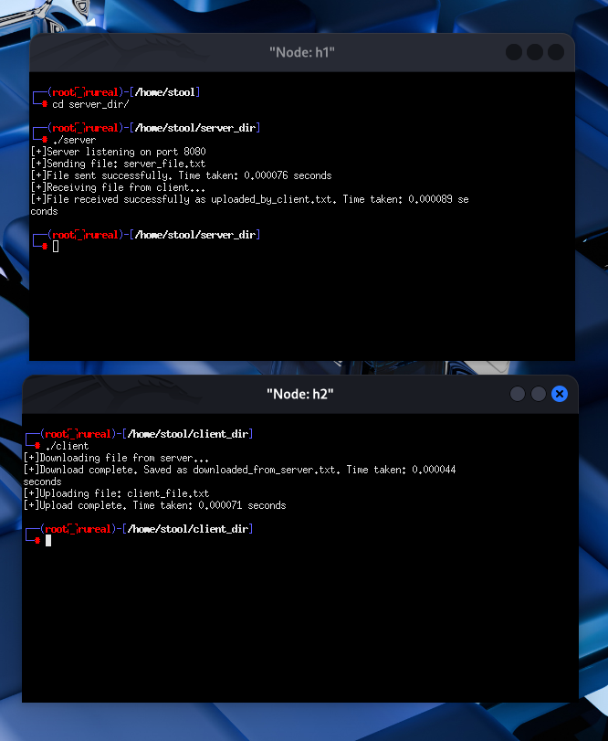
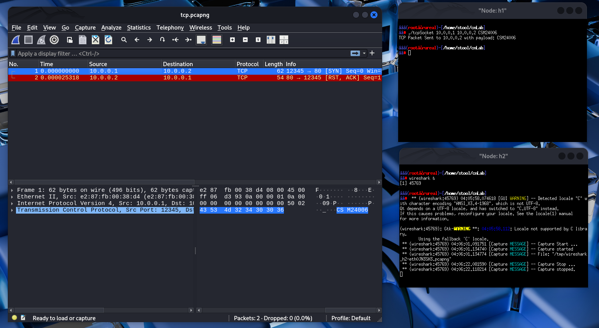
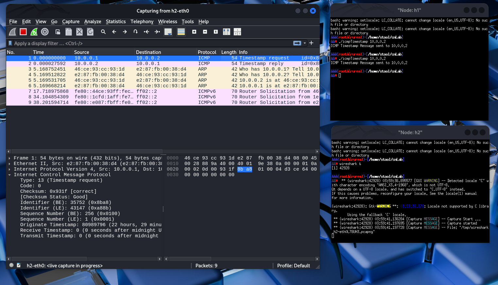
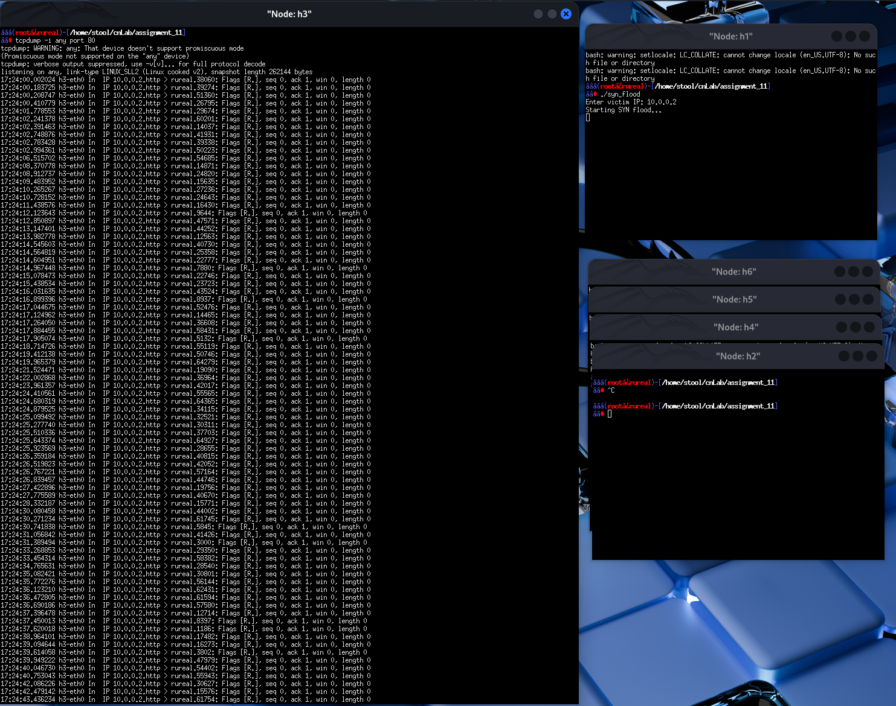
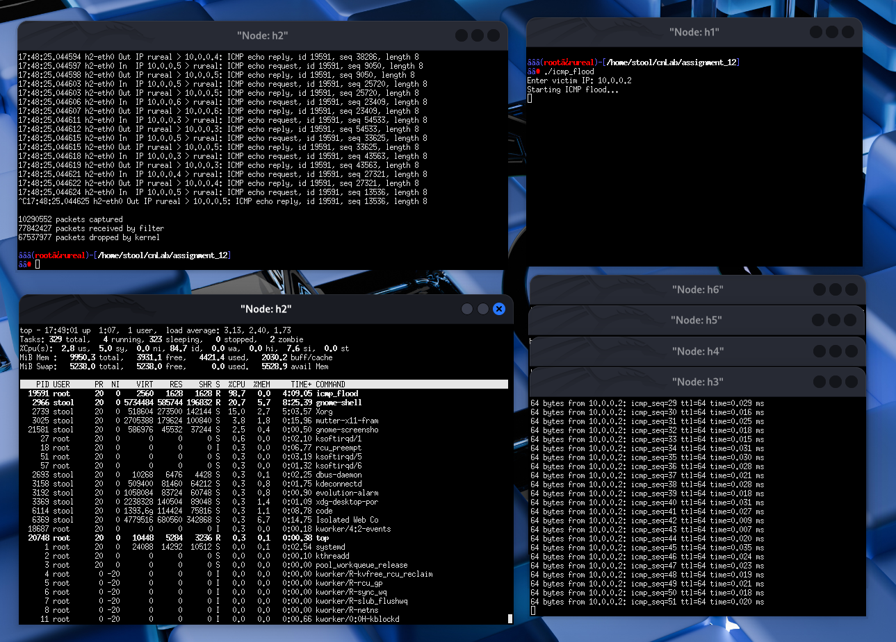
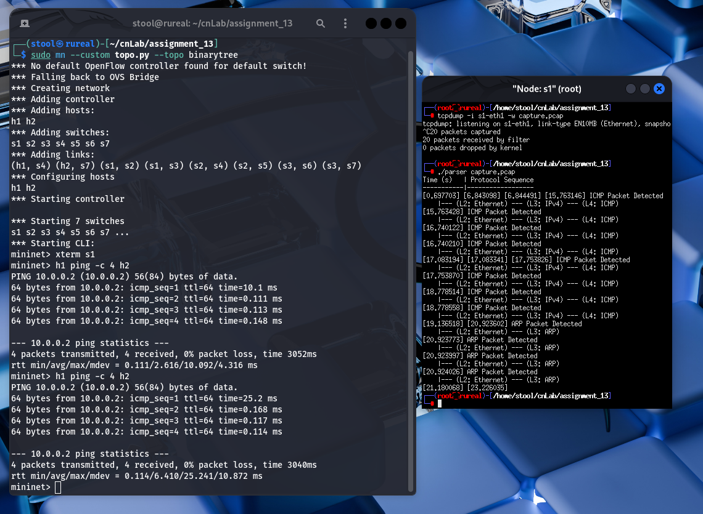

# Computer Networks Lab Assignments

This repository contains implementations for 14 Computer Networks lab assignments covering various aspects of network programming, socket programming, packet analysis, and network security.

## Assignment 1: Basic TCP Socket Programming
**Question**: Write TCP client and server programs where client says "Hi" and server responds "Hello".

**Implementation**: 
- `tcpserver.c` - TCP server that listens and responds with "Hello"
- `tcpclient.c` - TCP client that sends "Hi" to server

**Output**:


**Key Learning**: Basic TCP socket communication using `socket()`, `bind()`, `listen()`, `accept()`, `connect()`

---

## Assignment 2: TCP Fruit Store Server
**Question**: Implement a TCP-based fruit store where multiple clients can purchase fruits, server maintains inventory, and tracks customer transactions.

**Implementation**:
- `server.c` - Multi-client fruit store server with inventory management
- `client.c` - Client for purchasing fruits

**Output**:


**Key Features**:
- Server maintains fruit records (name, quantity, timestamp)
- Multiple client support
- Customer tracking by IP:port
- Inventory updates after each transaction
- Regret messages for insufficient stock

---

## Assignment 3: UDP Fruit Store Server
**Question**: Redo Assignment 2 using UDP sockets instead of TCP.

**Implementation**:
- `server.c` - UDP-based fruit store server
- `client.c` - UDP client for fruit purchases

**Output**:


**Key Differences**: Uses `sendto()` and `recvfrom()` instead of TCP's connection-oriented approach

---

## Assignment 4: Wireshark Packet Analysis
**Question**: Use Wireshark to capture packets during PING operation, analyze headers, and create time diagrams.

**Deliverables**:
- `assignment_04.pcapng` - Captured packet file
- `headerFields.md` - L2/L3/L4 header field analysis
- `timeDiagram.md` - Protocol sequence documentation
- `timeDiagram.pdf` - Visual time diagram
- `headerAnalysis.png` - Header structure analysis

**Visual Analysis**:


**Key Learning**: Understanding packet capture, protocol headers (Ethernet, IP, ICMP), and packet flow analysis

---

## Assignment 5: Traffic Generation Tools
**Question**: Learn and use multiple packet generation tools like Iperf, D-ITG for traffic analysis.

**Outputs**:


**Tools Used**:
- Iperf for bandwidth testing
- D-ITG for traffic generation
- Packet capture analysis

---

## Assignment 6: TCP Traffic Analysis
**Question**: Develop a C-based network simulator to analyze TCP traffic using raw sockets.

**Implementation**:
- `traffic.c` - Network traffic analyzer using raw sockets and packet capture libraries

**Output**:


**Key Learning**: Raw socket programming, packet header extraction, TCP/IP library usage

---

## Assignment 7: UDP Scientific Calculator
**Question**: Create UDP client-server for scientific calculator operations with packet loss detection.

**Implementation**:
- `server.c` - UDP server with scientific calculator functions (sin, cos, +, -, *, /, etc.)
- `client.c` - UDP client sending mathematical expressions
- `calculatorGuide.md` - Usage guide and supported operations

**Output**:


**Features**:
- Mathematical operations using math.h
- Packet loss detection with Wireshark
- Graceful UDP communication handling

---

## Assignment 8: Multi-threaded Chat Server
**Question**: Build a TCP-based group chat server using threads where multiple clients can communicate.

**Implementation**:
- `server.c` - Multi-threaded chat server with message logging
- `client.c` - Chat client for group communication

**Output**:


**Features**:
- pthread library for handling multiple clients
- Real-time message broadcasting
- Message logging with timestamps
- Group chatroom functionality

---

## Assignment 9: File Transfer System
**Question**: Implement TCP-based file upload/download system with transfer time calculation.

**Implementation**:
- Server directory: `server.c`, `server_file.txt`
- Client directory: `client.c`, `client_file.txt`
- Transfer tracking: `uploaded_by_client.txt`, `downloaded_from_server.txt`

**Output**:


**Features**:
- Bidirectional file transfer
- Transfer time measurement using time.h
- Separate client and server directories

---

## Assignment 10: Raw Socket Programming
**Question**: Use raw sockets to send TCP packets with custom payload and ICMP timestamp messages.

**Implementation**:
- `tcpSocket.c` - Raw TCP packet generation with roll number payload
- `icmpTimestamp.c` - ICMP timestamp message generation

**Packet Analysis**:



**Packet Captures**:
- `tcp.pcapng` - TCP packet analysis
- `icmp_timespamp_10.pcapng` - ICMP timestamp packet capture

---

## Assignment 11: TCP SYN Flood Attack
**Question**: Implement TCP SYN flood DDoS attack using raw sockets with multiple agent hosts.

**Implementation**:
- `syn_flood.c` - SYN flood attack generator using raw sockets

**Output**:


**Setup**: 6 Mininet hosts (1 attacker, 1 victim, 4 spoofed agents)
**Learning**: Understanding DDoS attack patterns and TCP control message exploitation

---

## Assignment 12: ICMP Flood Attack
**Question**: Implement ICMP-based flooding attack similar to Assignment 11.

**Implementation**:
- `icmp_flood.c` - ICMP flood attack generator
- `icmp_flood` - Compiled executable

**Output**:


**Setup**: Same 6-host Mininet topology as Assignment 11
**Learning**: ICMP-based DDoS attack patterns

---

## Assignment 13: Packet Analysis with Binary Tree Topology
**Question**: Create binary tree topology in Mininet, capture packets, and analyze protocols during PING operations.

**Implementation**:
- `topo.py` - Binary tree topology creation script
- `analyzer.c` - Packet header extraction and analysis
- `parser.c` - Protocol parsing and time diagram generation
- `capture.pcap` - Captured packet file

**Output**:


**Analysis**: L2/L3/L4 protocol identification and time sequence analysis

---

## Assignment 14: Custom Leaf-Spine Topology
**Question**: Create scalable leaf-spine topology in Mininet using Python API.

**Implementation**:
- `leaf_spine_topology.py` - Main leaf-spine topology implementation
- `test_topology.py` - Topology testing script
- `examples.py` - Usage examples and demonstrations
- `README.md` - Topology documentation and scaling guide

**Features**:
- Scalable with increasing switch radix
- Mininet API utilization
- Fat-tree topology reference implementation

---

## Key Technologies and Concepts Covered

### Programming Languages & Libraries
- **C Programming**: Socket programming, threading, raw sockets
- **Python**: Mininet API, network topology creation
- **Libraries**: pthread, math.h, time.h, socket libraries

### Network Protocols
- **TCP**: Connection-oriented communication, reliability
- **UDP**: Connectionless communication, packet loss handling
- **ICMP**: Network diagnostics, timestamp messages
- **Raw Sockets**: Custom packet generation

### Tools & Technologies
- **Mininet**: Network emulation and testing
- **Wireshark**: Packet capture and analysis
- **Iperf**: Bandwidth testing
- **D-ITG**: Traffic generation

### Security Concepts
- **DDoS Attacks**: SYN flood, ICMP flood
- **Packet Analysis**: Header extraction, protocol identification
- **Network Simulation**: Traffic analysis and monitoring

### Network Programming Concepts
- **Multi-threading**: Concurrent client handling
- **File Transfer**: Upload/download mechanisms
- **Real-time Communication**: Chat systems
- **Traffic Generation**: Performance testing

---

## How to Run

Each assignment folder contains the necessary source files and can be compiled using:
```bash
gcc -o program_name source_file.c -lm -lpthread
```

For Mininet-based assignments:
```bash
sudo mn --custom topology_file.py --topo topology_name
```

For packet capture:
```bash
sudo wireshark  # or tshark for command line
```

---

## Repository Structure
```
cnLab/
├── assignment_01/ - Basic TCP Socket Programming
├── assignment_02/ - TCP Fruit Store Server
├── assignment_03/ - UDP Fruit Store Server
├── assignment_04/ - Wireshark Packet Analysis
├── assignment_05/ - Traffic Generation Tools
├── assignment_06/ - TCP Traffic Analysis
├── assignment_07/ - UDP Scientific Calculator
├── assignment_08/ - Multi-threaded Chat Server
├── assignment_09/ - File Transfer System
├── assignment_10/ - Raw Socket Programming
├── assignment_11/ - TCP SYN Flood Attack
├── assignment_12/ - ICMP Flood Attack
├── assignment_13/ - Packet Analysis with Topology
├── assignment_14/ - Custom Leaf-Spine Topology
└── README.md - This comprehensive guide
```

Each assignment demonstrates progressive learning in computer networks, from basic socket programming to advanced topics like network security, protocol analysis, and custom topology creation.
